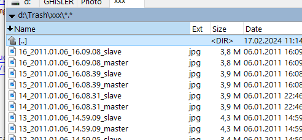
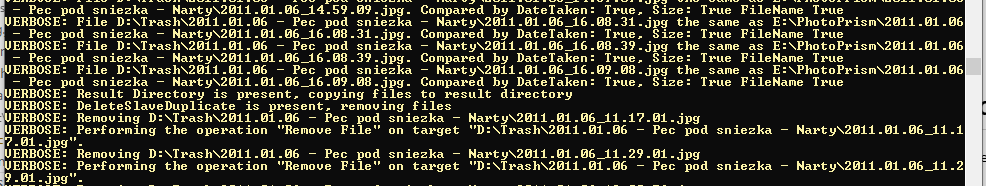

<!--Category:PowerShell--> 
 <p align="right">
    <a href="https://www.powershellgallery.com/packages/ProductivityTools.FindModuleDependencies/"></a>
    <a href="http://productivitytools.tech/find-module-dependencies/"><a> 
    <a href="https://github.com/pwujczyk/ProductivityTools.FindModuleDependencies/"></a>
</p>
<p align="center">
    <a href="http://http://productivitytools.tech/">
        
    </a>
</p>

# Find Module Dependencies

Module allows to find the duplicates in two folders. It compares photos by 

<!--more-->

The method have two cmdlet:
- Find-PhotographDuplicates 
- Find-PhotographDuplicatesInDirectory

```
Find-PhotographDuplicates -CompareSize -CompareFileName -PathMaster e:\PhotoPrism\ -PathSlave "d:\Trash\2011.01.06 - Pec pod sniezka - Narty\" -ResultDirectory d:\trash\xxx -DeleteSlaveDuplicatess -Verbose
```

- Path Master - directory where we have main photo albums. We won't do anything with files in this file
- Path Slave - directory where we expect to have duplicates. As a result of this script photos from this directory will be deleted.
- Result directory - script compares the photos from two directories if duplicate is found it copies both files to the result directory, one photo has suffix _master the second _slave. You can then validate if photos are the same



