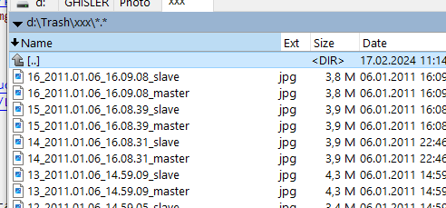
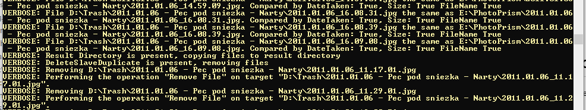

<!--Category:PowerShell--> 
 <p align="right">
    <a href="https://www.powershellgallery.com/packages/ProductivityTools.FindModuleDependencies/"></a>
    <a href="http://productivitytools.tech/find-module-dependencies/"><a> 
    <a href="https://github.com/pwujczyk/ProductivityTools.FindModuleDependencies/"></a>
</p>
<p align="center">
    <a href="http://http://productivitytools.tech/">
        
    </a>
</p>

# Find Photograph Duplicates


This PowerShell module helps you find and manage duplicate photographs. It can compare photographs based on date/time taken, and optionally by size and filename.

<!--more-->


## Features

*   Find duplicate photographs between a master and a slave directory.
*   Find duplicate photographs within a single directory.
*   Optionally delete duplicates found in the slave directory or the single directory.
*   Optionally copy identified duplicates (master and slave versions) to a separate result directory for review.
*   Pre-generate a photograph data file from a master directory to speed up subsequent comparisons.

## Installation

1.  Clone or download this repository.
2.  Navigate to the module directory in PowerShell.
3.  Import the module:
    ```powershell
    Import-Module .\ProductivityTools.FindPhotographDuplicates\ProductivityTools.FindPhotographDuplicates.psd1 -Force
    ```

## Functions

### `Find-PhotographDuplicates`

Compares photographs in a master location against a slave directory to find duplicates.

**Syntax:**

```powershell
# Parameter Set: PathInput (Default)
Find-PhotographDuplicates -PathMaster <string> -PathSlave <string> [-CompareSize] [-CompareFileName] [-ResultDirectory <string>] [-DeleteSlaveDuplicatess] [-Verbose]

# Parameter Set: FileInput
Find-PhotographDuplicates -PathMasterDuplicateFile <string> -PathSlave <string> [-CompareSize] [-CompareFileName] [-ResultDirectory <string>] [-DeleteSlaveDuplicatess] [-Verbose]
```

**Parameters:**

*   `-PathMaster <string>`: Path to the master directory of photographs. (Used with `PathInput` set)
*   `-PathMasterDuplicateFile <string>`: Path to a pre-generated file containing master photograph data (e.g., created by `Prepare-PhotographDuplicateFile`). This can significantly speed up processing if the master set is large and scanned frequently. (Used with `FileInput` set)
*   `-PathSlave <string>`: Path to the slave directory where duplicates will be searched for.
*   `-CompareSize [<SwitchParameter>]`: If specified, photographs will also be compared by file size.
*   `-CompareFileName [<SwitchParameter>]`: If specified, photographs will also be compared by file base name.
*   `-ResultDirectory <string>`: Optional. Path to a directory where master and slave versions of duplicates will be copied for review. The directory must not exist.
*   `-DeleteSlaveDuplicatess [<SwitchParameter>]`: Optional. If specified, duplicate files found in the slave directory will be deleted. **Use with caution!**
*   `-Verbose`: Provides detailed output of the script's operations.

**Example (using directory scan for master):**
```powershell
Find-PhotographDuplicates -PathMaster "D:\Photos\Master" -PathSlave "D:\Photos\Import" -CompareSize -ResultDirectory "D:\Photos\DuplicatesReview" -Verbose
```

**Example (using pre-generated master file):**
```powershell
Find-PhotographDuplicates -PathMasterDuplicateFile "D:\Photos\Master\MasterPhotoData.txt" -PathSlave "D:\Photos\Import" -CompareSize -Verbose
```

### `Prepare-PhotographDuplicateFile`

Scans a directory for photographs and saves their metadata (path, date taken, size, filename, extension) to a CSV file. This file can then be used with the `-PathMasterDuplicateFile` parameter of `Find-PhotographDuplicates` to speed up the loading of the master photograph list.

**Syntax:**
```powershell
Prepare-PhotographDuplicateFile -Path <string> [-Verbose]
```

**Parameters:**
*   `-Path <string>`: Path to the directory containing photographs to be scanned.
*   `-Verbose`: Provides detailed output of the script's operations.

**Output:**
*   Creates a file named `PhotographDuplicateCompareFile.txt` in the current working directory, containing the photograph data in CSV format.

**Example:**
```powershell
Prepare-PhotographDuplicateFile -Path "D:\Photos\MasterCollection" -Verbose
# This will create PhotographDuplicateCompareFile.txt in the current directory.
```

### `Find-PhotographDuplicatesInDirectory`

Finds duplicate photographs within a single directory. 

---
*Note: Always back up your photographs before running scripts that perform delete operations.*



